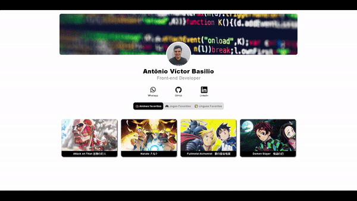

# Portfólio em React.js

projeto feito com React. Navegue pelas abas de "animes favoritos", "jogos favoritos" e "línguas favoritas" para testar

## Instalação

Para utilizar o projeto em sua máquina local, baixe os arquivos e digite `npm install` no terminal.  

## Rodando o projeto

Utilize o comando `npm start` no terminal para abrir o projeto em [http://localhost:3000](http://localhost:3000)

## Gif do projeto

## <a href="https://go-beyond-desafio-react.vercel.app/" target="_blank">Link do deploy</a>

